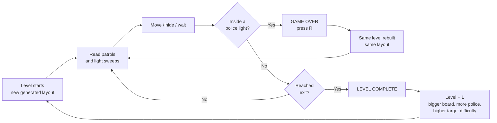
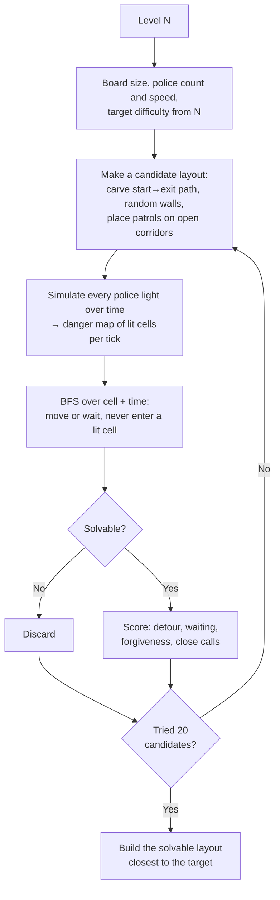

# MimiMeowmeow — Paired Prototype

**Team:** Butian Xiong, Utkarsh L.
**GitHub repository: https://github.com/saliteta/MeowmeowMimi
**Playable build (GitHub Pages): https://saliteta.github.io/MeowmeowMimi/
**Gameplay video (< 1 min): https://www.youtube.com/watch?v=JgKEyqyUghM&feature=youtu.be

---

## 1. Logline

> A top-down 2D stealth game where you slip past sweeping police flashlights through endless, procedurally generated levels that are each proven escapable, and tuned to get harder, by a built-in solver **(Stealth + Solver-Tuned Procedural Levels)**.

---

## 2. Genre Tropes Research and Twist

### Games researched

| Game | Detection | Enemy behaviour | Cover | Levels |
|---|---|---|---|---|
| **Metal Gear Solid** (1998) | Guard vision cones; being seen raises an alert | Fixed patrol routes that can be learned | Walls, corners, boxes | Hand-designed |
| **Mark of the Ninja** (2012, 2D) | Light and shadow: standing in light makes you visible; guards carry flashlights | Patrols with predictable timing | Darkness, walls, objects | Hand-designed |
| **Monaco: What's Yours Is Mine** (2013, top-down) | Guard vision cones clipped by walls (line of sight) | Patrol loops; guards chase once alerted | Walls and line of sight | Hand-designed heists |

### Shared tropes

1. **Vision cones or light mean detection.** The player must stay outside a visible area around each enemy.
2. **Predictable patrols.** Enemies loop fixed routes, so the challenge is reading the pattern and timing a move.
3. **Walls block sight.** Geometry is both an obstacle and cover.
4. **Reach the exit or objective unseen.** Being seen causes failure or a penalty, followed by a quick retry.
5. **Hand-authored levels.** A designer places every guard and wall and tunes the difficulty by hand, so replay value is limited.

### Our twist: solver-tuned procedural levels

Our levels are **generated, not authored**, and an **automated solver plays every candidate level before the player sees it**:

- The police are fully predictable, so the game simulates every flashlight into the future and runs a **breadth-first search over (cell, time)** to find whether a safe route to the exit exists.
- Unsolvable layouts are thrown away. The solver scores the rest with measurable difficulty metrics (below), and the layout closest to the level's **target difficulty** is built.
- Each new level has a bigger board, more police, faster patrols and a higher target difficulty, so the game gets steadily harder without end.

**Why it's new for the genre:** stealth games rely on a designer to guarantee that a level is fair: a gap exists in the patrols, and the exit isn't permanently watched. Randomly placing guards normally breaks that guarantee. Some stealth games do generate levels (for example, the turn-based *Invisible, Inc.*), but they don't prove each level can be escaped or measure its difficulty. Our generator does both, in real time, with continuously sweeping lights. The trope of a fair, hand-tuned stealth level becomes endless levels that are fair by construction.

**Difficulty metrics computed by the solver:**

| Metric | Meaning for the player |
|---|---|
| Solvable | The exit can be reached without being seen (required) |
| Detour | Fastest safe escape time ÷ escape time with no police: how far the lights push you off the direct path |
| Waiting | Seconds the fastest route must stand still: how much timing is needed |
| Forgiveness | Share of reachable (position, time) states from which escape is still possible: how punishing one mistake is |
| Close calls | Steps of the fastest route where a light passes within about 0.4 s |

---

## 3. Prototype Description

The player moves a character with WASD through a walled top-down board patrolled by police whose flashlight cones move and sweep. Stepping into any light, unless a wall blocks it, ends the run immediately, and the goal is to reach the exit zone. Every level is newly generated, verified escapable and harder than the last: the board grows, more police appear, patrols speed up, and the solver's target difficulty rises. The player therefore can't memorise layouts and must read each new set of patrol patterns and wait for their chance.

**Controls:** `W` `A` `S` `D` to move · `R` to restart after being caught. The next level loads automatically after reaching the exit.

---

## 4. Twist & Mechanics Matrix

| Twist | Core mechanic | Player action | How the twist changes the mechanic | Resulting challenge |
|---|---|---|---|---|
| Solver-tuned procedural levels (every layout is generated, proven escapable and chosen to match a rising difficulty target) | Avoid moving, sweeping flashlight cones (light = death; walls block light) | Move, hide behind walls, wait for a light to pass, then dash | Light avoidance can't rely on memorised, hand-made layouts. Each level is a fresh patrol puzzle that is guaranteed to have a safe route and is measurably harder (longer detours, more forced waiting, less room for error) | The player must read patterns quickly and time their moves under steadily rising pressure, and each run is different |

---

## 5. Diagrams

### Core game loop



### Level generation pipeline



### Example level (sketch)

```
 ┌────────────────────────────────────────┐
 │ P . . . ███ . . . . . . . ███ . . . .  │   P  = player start (police light never reaches it)
 │ . . . . ███ . . ◄▲►. . . . . . . . . . │   E  = exit (wayOut)
 │ . . . . . . . . ╲│╱ . ███████ . . . .  │   ◄▲► = police officer, light sweeps back and forth
 │ ███ . . . . . .  ▼  . . . . . . ◄▲► .  │   ███ = wall (blocks movement and light)
 │ . . . . ████ . . . . . . . . . ╲│╱ . E │   ~~~ = solver's fastest safe route
 │ ~~~~~~~~~~~~~~ wait ~~~~~~~~~~~~~~~~~~ │
 └────────────────────────────────────────┘
```

---

## 6. Implementation Overview (Unity 6, URP 2D)

| Script | Role |
|---|---|
| `PlayerMovement.cs` | WASD movement through a `Rigidbody2D` (new Input System) |
| `EnemyPatrol.cs` | Police patrol through position and rotation waypoints. Computed from elapsed time, so it is exactly predictable |
| `PoliceVision.cs` | Detection: the player is caught if inside the Spot Light 2D radius and cone, with no wall between (raycast) |
| `die.cs` | Game over: freeze, show GAME OVER, `R` restarts |
| `WinZone.cs` | Exit zone: reaching it completes the level |
| `LevelGenerator.cs` | Builds levels (walls, border, player, exit, police), grows difficulty per level, fits the camera |
| `LevelSolver.cs` | Danger-map simulation, space-time BFS, difficulty metrics and score |
| `ShadowSetup.cs` / `lightArc.cs` | Light/shadow setup (URP `ShadowCaster2D`) and light-cone visuals |

No external assets are used; all visuals are Unity's built-in 2D primitive shapes and 2D lights.

---

## 7. Individual Contributions

Both team members contributed **equally (50 / 50)** to design and coding. We worked on the following together:

- Game concept, genre research, twist and difficulty design
- Player movement and police patrol mechanics
- Police light detection, game-over and exit / level-complete flow
- Lighting and shadows (URP 2D lights and shadow casters)
- Procedural level generator and solver-based difficulty system
- Prefabs and scenes, WebGL build and GitHub Pages hosting, gameplay video, and this document

---

## 8. AI Tool Usage

_As required by the course policy, AI usage must be approved by a course producer or grader and documented here._

- **Approval:** _TODO: approved by ___ on ___._
- **Tool:** Claude Code (Anthropic, Claude Opus 5.5).
- **Used for:**
  - Writing and debugging gameplay scripts from our design: `PoliceVision.cs`, `die.cs`, `WinZone.cs`, `LevelGenerator.cs`, `LevelSolver.cs`, and the time-based rewrite of `EnemyPatrol.cs`
  - Suggesting the space-time BFS approach to measuring difficulty
  - Git commits and README upkeep
  - Drafting this document
- **Done by the team:**
  - The game concept and core mechanic
  - The direction of the level generator: bigger boards and more police each level, plus the original idea of using BFS to measure how much room the player has
  - Scene and prefab setup in Unity, all testing and tuning
